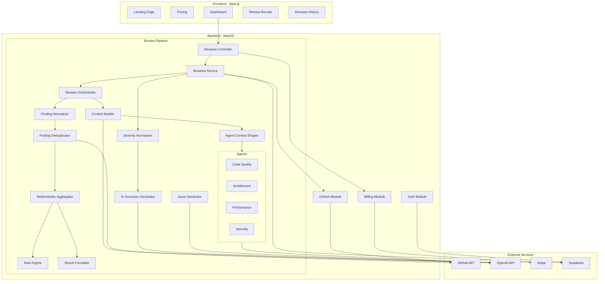
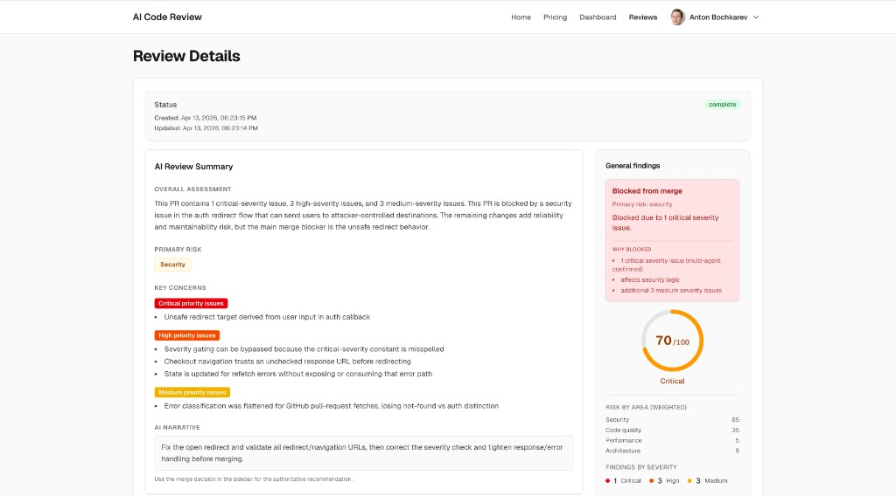
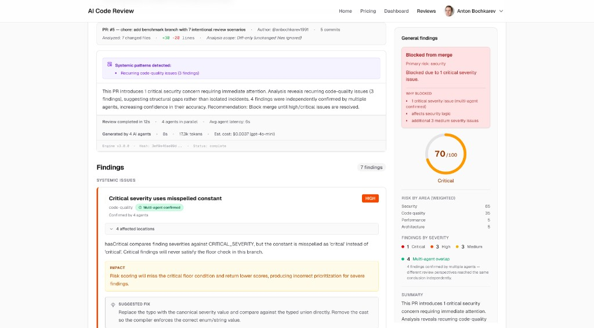

# AI Code Review Assistant

Multi-agent PR analysis with deterministic scoring — four specialized LLM agents review pull requests for code quality, architecture, performance, and security in parallel, producing a quantified risk score and merge recommendation.

Unlike tools that pass an entire PR to a single prompt and return unstructured prose, this system decomposes the review into specialized agents, normalizes their output through deterministic pipelines, and treats cost as a first-class constraint. The design prioritizes consistency and auditability: deterministic aggregation over black-box scoring, diff-scoped context over whole-file analysis, and per-agent token budgets over unbounded cost.

**→ [View Architecture](#architecture)**

**Live demo:** [ai-code-review-gamma.vercel.app](https://ai-code-review-gamma.vercel.app/)


---

## What makes this system interesting

- **Multi-agent orchestration with partial failure tolerance.** Four agents run in parallel via `Promise.allSettled` with independent timeouts and retries. A single agent failure degrades the review gracefully — it never blocks the pipeline.
- **No LLM in the scoring path.** Risk scores, merge decisions, and severity normalization are pure functions. Same inputs always produce the same outputs — auditable and reproducible.
- **Cost as a first-class constraint.** Per-agent token budgets (~4,500 tokens), tracked usage, and USD cost estimates are built into the pipeline — not bolted on after the fact.
- **LLM output treated as noisy signal.** Findings pass through confidence clamping, diff boundary enforcement, severity calibration, and cross-agent deduplication before reaching the user.

---

## Core concepts

- **Multi-agent, not single-prompt.** Four independent agents (code quality, architecture, performance, security) analyze the same diff in parallel. Findings are cross-referenced and deduplicated — multi-agent agreement boosts confidence.
- **Diff-first analysis.** Only changed code is sent to agents. Enclosing functions and referenced declarations are pulled from GitHub as local context, but entire files are never shipped.
- **Deterministic aggregation.** Risk scoring, merge decisions, and normalization are pure functions. Same diff + same agent outputs = same result, every time.
- **Cost-aware by design.** Token usage is tracked per agent and converted to USD estimates. Per-agent budgets (~4,500 tokens) prevent runaway costs on large PRs.
- **Structured, not conversational.** Agent output is Zod-validated. Findings pass through confidence clamping, severity calibration, and deduplication before reaching the user.
- **Reproducible by default.** Reviews are stamped with SHA-256 hashes and engine/agent version tags. Deterministic scoring and fixed token budgets mean results are predictable across runs — not dependent on LLM temperature or unbounded context.

### Design trade-offs

- **Diff-first, not full-repo.** Sending entire files to an LLM is expensive and noisy — most of the content is unchanged code. By scoping analysis to the diff and pulling only enclosing functions and referenced declarations as local context, the system keeps token usage predictable and findings anchored to what actually changed. The tradeoff is reduced visibility into broader codebase patterns, which is acceptable for a PR-scoped tool.
- **Deterministic aggregation, not LLM-based merging.** Risk scoring and merge decisions are pure functions — no LLM in the critical path after findings are produced. This makes outputs reproducible and auditable: the same findings always produce the same score and verdict. A fully LLM-based merge step would be more flexible but would sacrifice reproducibility and make debugging regressions harder.
- **Fixed token budgets per agent.** Each agent receives ~4,500 tokens of diff content with local context. This caps per-review cost at a predictable ceiling and forces the context-shaping layer to prioritize high-signal hunks. The tradeoff is truncation on very large PRs — but unbounded context leads to unbounded cost and diluted agent attention.

---

## Architecture

The system is designed as a multi-agent pipeline for structured pull request analysis.

### Flow

PR Diff → Agents → Aggregation → Final Review

### Agents

Each agent operates independently on a scoped diff context:

* **Security Agent** — detects vulnerabilities and unsafe patterns
* **Performance Agent** — identifies inefficiencies and bottlenecks
* **Architecture Agent** — validates structural and design decisions
* **Code Quality Agent** — enforces consistency and best practices

### Aggregation Layer

A deterministic aggregation layer merges all findings:

* deduplicates overlapping issues
* normalizes severity across agents
* produces a single, consistent final score

### Key Design Decisions

* **Diff-first analysis**
  Avoids full-repo context → reduces token usage and cost

* **Deterministic output**
  Ensures reproducible results across runs

* **Cost-aware pipeline**
  Limits unnecessary LLM calls and controls spend

* **Multi-agent separation**
  Improves signal quality vs single-prompt approaches

### Why not a single LLM call?

Single-prompt reviewers are cheaper to build but:

* mix concerns (security, performance, etc.)
* produce inconsistent outputs
* are harder to reason about and debug

This system trades simplicity for control, structure, and reliability.

### System Diagram



**Separation of concerns:**

- **Frontend** handles auth (Supabase SSR), navigation, and rendering. It has no business logic — it sends requests to the backend and displays results.
- **Backend** owns the entire review pipeline, billing, and GitHub integration. Each NestJS module (Auth, GitHub, Billing, Reviews) is self-contained.
- **Shared** package contains TypeScript types, Zod schemas, merge-decision logic, risk breakdown/summary helpers, and model rate tables — used by both frontend and backend.
- **Agents** are isolated injectable services. Each receives parsed diff files and returns structured findings validated against a shared schema.
- **Aggregation** is deterministic — no randomness in scoring, merge decisions, or normalization. Same diff + same agent outputs = same result.

---

## Overview

The system connects to GitHub repositories, fetches PR diffs, and runs them through a multi-agent analysis pipeline. Findings are normalized, deduplicated, scored for risk, and presented as a structured review with a merge recommendation.

Teams use it as a fast first pass — covering domains easy to overlook under time pressure (performance anti-patterns, security issues, architectural drift) — while keeping human reviewers focused on design intent and business logic. The pipeline behaves predictably under varying PR sizes: token budgets cap cost, partial failures are handled without blocking, and all scoring is deterministic.

---

## Why this project exists

Manual code reviews are inconsistent. Reviewers gravitate toward surface-level issues while architectural problems and security risks go unnoticed. Under time pressure, reviews get rushed or skipped entirely.

This project provides a structured, repeatable review pipeline that:

- Runs in seconds — four agents analyze the PR diff in parallel.
- Produces a quantified risk score and deterministic merge recommendation, giving teams a data-informed signal alongside human judgment.
- Tracks review cost and token usage transparently.

It is not a replacement for human review. It is a fast first pass that catches what humans tend to miss.

---

## Key capabilities

- **Diff-scoped analysis** — only changed code is analyzed; unchanged files are excluded.
- **Four specialized agents** — Code Quality, Architecture, Performance, and Security run in parallel with independent timeout and retry logic.
- **Git-backed context expansion** — agents receive not just diff hunks but enclosing functions and referenced declarations fetched from GitHub, improving finding accuracy without sending entire files.
- **Deterministic risk scoring** — exponential risk model (0–100) based on severity-weighted findings.
- **Centralized merge decision** — a single pure function in the shared package determines the merge verdict from severity counts and risk score. Any critical or high finding blocks merge; risk score >= 60 or any medium findings triggers caution.
- **Multi-layer finding normalization** — confidence clamping, diff boundary enforcement, cross-agent consolidation, severity calibration (impact/likelihood matrix, multi-agent boosts, overflow controls), and false positive risk estimation.

### Additional features

- **LLM cross-file deduplication** — when 4+ findings exist, an LLM grouping step merges findings that share a root cause, consolidating agent metadata and consensus.
- **Security severity overrides** — security findings receive policy-driven post-processing (e.g. open redirect in auth callback is escalated to critical) with confidence floors and downgrade guards.
- **AI Review Summary** — concise executive overview with overall assessment, primary risk area, key concerns grouped by severity, and an AI-generated narrative recommendation.
- **Systemic issue detection** — recurring patterns across findings are surfaced separately from code-level issues.
- **LLM-powered issue generation** — each finding has a "Generate issue" action that produces a structured issue draft (title, description, steps to reproduce, acceptance criteria) via a one-shot LLM call.
- **Review telemetry** — per-agent latency, token counts, prompt sizes, status, and confidence tracked in every review.
- **Cost estimation** — USD cost computed from token usage and model rates.
- **Review integrity** — SHA-256 review hash and engine/agent version stamps (v3.0.0) for reproducibility.
- **Usage-based billing** — free tier (10 reviews/month) and Pro tier (200 reviews/month) via Stripe.
- **Review history** — all past reviews are persisted and browsable with completion and failure statuses.

---

## Product walkthrough

### 1. Connect and select

After signing in (Google or Microsoft) and connecting your GitHub account, the dashboard lists your repositories. Select a repo and an open pull request.


*The dashboard shows your profile, usage quota, plan status, and GitHub connection. The repository dropdown lists all accessible repos, including private ones.*


*After selecting a repository, open pull requests are loaded and shown in a dropdown.*

### 2. Run the review

Click **Run Code Review**. The backend fetches the PR diff from GitHub, parses it, and dispatches it to four agents in parallel. A typical review completes in under 15 seconds.

### 3. Read the results

The review result page has two main areas — a scrollable content column and a sticky **General Findings** sidebar.

**Content column:**

- **AI Review Summary** — overall assessment, primary risk area (e.g. Security), key concerns grouped by severity (critical / high / medium), and an AI-generated narrative recommendation.
- **PR metadata** — file count, additions/deletions, commit count, analysis scope.
- **Systemic patterns** — recurring issues flagged separately with clickable details.
- **Execution telemetry** — agent count, duration, average latency, tokens, estimated cost, engine version, and review hash.
- **Individual findings** — each with severity badge, category, multi-agent confirmation indicator, affected locations, impact description, suggested fix, and diff context.

**General Findings sidebar:**

- **Merge recommendation** — actionable decision (Safe to merge / Merge with caution / Merge blocked) with a "Why blocked" or "Why cautioned" breakdown.
- **Risk score** — 0 to 100 donut chart with risk level label (Low / Moderate / High / Critical).
- **Risk by area** — weighted scores per domain (Security, Code quality, Performance, Architecture).
- **Severity breakdown** — counts of critical, high, medium, and low findings.
- **Multi-agent overlap** — count of findings independently confirmed by multiple agents.
- **Summary** — condensed text overview of the review.



*AI Review Summary showing overall assessment, primary risk (Security), key concerns grouped by priority, and narrative recommendation. The sidebar shows the merge decision (Blocked from merge), risk score (70/100, Critical), and weighted risk breakdown by area.*



*Findings section with severity badges, multi-agent confirmed indicators, affected locations, impact descriptions, and suggested fixes. Systemic issues are surfaced above code-level findings. The sidebar remains visible with the merge decision and risk breakdown.*

### 4. Browse past reviews

All reviews are persisted and accessible from the **Reviews** page. Each entry shows PR title, repo, PR number, timestamp, finding count, and status (complete or failed).


*Review history showing completion and failure statuses. Failed reviews display an error label. Each entry links to the full review detail.*

---

## How it works

```
User selects repo + PR
        │
        ▼
Backend fetches PR diff via GitHub API
        │
        ▼
DiffParser filters and parses hunks
(ignores lock files, binaries, node_modules, etc.)
        │
        ▼
ContextBuilder
(fetches full files from GitHub, extracts enclosing
 functions and referenced declarations per hunk)
        │
        ▼
AgentContextShaper
(builds per-agent prompts with ~4,500-token budget;
 security agent gets security-relevant context only)
        │
        ▼
┌───────────────────────────────────────────┐
│     4 agents run in parallel              │
│  ┌──────────┐ ┌──────────┐ ┌──────────┐  │
│  │  Code    │ │  Archi-  │ │  Perfor- │  │
│  │  Quality │ │  tecture │ │  mance   │  │
│  └──────────┘ └──────────┘ └──────────┘  │
│  ┌──────────┐                             │
│  │ Security │  30s timeout / 1 retry each │
│  └──────────┘                             │
└───────────────────────────────────────────┘
        │
        ▼
FindingNormalizer
(confidence clamping, diff boundary enforcement,
 consolidation, consensus detection, false positive risk)
        │
        ▼
FindingDeduplicator
(LLM groups findings sharing a root cause,
 merges agent metadata and consensus)
        │
        ▼
DeterministicAggregator
(risk score, risk level, merge decision,
 systemic patterns, review summary)
        │
        ▼
ResultFormatter
(execution metadata, cost estimate, telemetry)
        │
        ▼
SeverityNormalizer
(impact/likelihood classification, multi-agent boosts,
 security overrides, cap enforcement, overflow controls)
        │
        ▼
AiSummaryGenerator
(LLM synthesizes findings into executive summary)
        │
        ▼
Persist to Supabase + return to frontend
```

Each agent receives a diff-first prompt with limited local context (enclosing functions, referenced declarations) shaped per agent specialization. Agent output is validated against a shared Zod schema with up to 2 retries on malformed JSON. The orchestrator uses `Promise.allSettled` so a single agent failure never blocks the pipeline — partial results are still returned and clearly labeled.

---

## Technical highlights

- **Diff-first with local context.** The `DiffParser` filters out non-code files (lock files, binaries, generated assets). The `ContextBuilder` then fetches full files from GitHub and extracts enclosing functions, referenced declarations, and called helpers per hunk. The `AgentContextShaper` builds per-agent prompts within a ~4,500-token budget, with the security agent receiving only security-relevant context.

- **Resilient orchestration.** `Promise.allSettled` with per-agent timeouts (30s default) and single retry on transient errors. Non-retryable errors (401, 402, 429) fail fast. Partial results are surfaced rather than lost.

- **Multi-layer normalization.** Findings pass through confidence clamping (0.3–0.95), diff boundary enforcement (outside-diff findings penalized), cross-agent consolidation, severity coherence, and uncertainty phrase detection. A separate severity calibration pipeline applies an impact/likelihood matrix, multi-agent boosts, confidence caps, and overflow controls.

- **LLM cross-file deduplication.** When 4+ findings exist, an LLM grouping call merges findings that share a root cause, consolidating agent metadata and multi-agent consensus. This reduces noise without losing signal.

- **Security severity overrides.** Security findings receive policy-driven post-processing. Open redirect patterns, unvalidated external URLs, and auth callback issues are escalated based on pattern matching, with confidence floors preventing false downgrades.

- **Deterministic merge logic.** The merge decision is a single pure function in the shared package (`decideMerge`) — no LLM involved. Any critical or high finding blocks merge; risk score >= 60 or any medium findings triggers caution.

- **AI Review Summary.** After findings are aggregated and normalized, a single LLM call synthesizes them into a concise executive summary (overall assessment, primary risk, key concerns grouped by severity, narrative recommendation). A factual severity prefix grounds the summary in actual finding counts. Generation is non-blocking — if it fails, the pipeline completes and the block is omitted.

- **LLM issue generation.** Each finding can be converted into a structured issue draft (title, description, steps to reproduce, acceptance criteria) via a one-shot LLM call, replacing the previous placeholder action buttons.

- **Zod-validated agent output.** Agent responses are parsed against a strict Zod schema with up to 2 retries, preventing malformed data from propagating through the pipeline.

- **Cost transparency.** Token usage is tracked per agent and converted to USD estimates using per-model rate tables defined in the shared package.

- **Review integrity.** Each review is stamped with a SHA-256 hash of the diff + engine/agent versions (v3.0.0), enabling reproducibility verification.

- **Controlled evaluation setup.** The test suite uses predefined diffs with known, seeded issues (SQL injection, missing auth checks, performance anti-patterns) to measure detection quality across the pipeline — normalization accuracy, severity calibration, deduplication correctness, and merge-decision consistency. This provides a repeatable baseline for comparing approaches and tuning agent prompts without relying on subjective review quality assessments.

- **Input validation and security hardening.** All external API responses (GitHub, Stripe, Supabase) are validated before nested access. Frontend validates Stripe checkout redirect URLs against an allowlist and sanitizes post-login redirect paths. Backend validates Stripe return URLs against `FRONTEND_URL`. See [docs/frontend-security.md](docs/frontend-security.md).

---

## Tech stack

| Layer | Technology |
|-------|-----------|
| Frontend | Next.js 16 (App Router), React 19, Tailwind CSS v4 |
| Backend | NestJS, Node.js 22 |
| Auth | Supabase Auth (Google, Microsoft OAuth), JWT |
| Database | Supabase (PostgreSQL) with Row Level Security |
| AI | OpenAI API (gpt-4o-mini default, configurable) |
| Billing | Stripe (subscriptions, webhooks, checkout) |
| Validation | Zod (shared schemas) |
| Deployment | Vercel (frontend), Railway / Koyeb / Docker (backend) |

---

## Running the project locally

### Prerequisites

- Node.js >= 22
- A [Supabase](https://supabase.com) project (see [docs/SUPABASE_SETUP.md](docs/SUPABASE_SETUP.md))
- A [GitHub OAuth App](https://github.com/settings/developers) (see [docs/GITHUB_SETUP.md](docs/GITHUB_SETUP.md))
- An [OpenAI API key](https://platform.openai.com/api-keys)
- Optionally, a [Stripe](https://stripe.com) account for billing (see [docs/STRIPE_SETUP.md](docs/STRIPE_SETUP.md))

### Environment variables

Create `.env` files from the examples:

```bash
# Root
cp .env.example .env

# Backend
cp backend/.env.example backend/.env

# Frontend
cp frontend/.env.example frontend/.env
```

**Backend** (`backend/.env`):

| Variable | Description |
|----------|-------------|
| `PORT` | Server port (default: 3001) |
| `SUPABASE_URL` | Your Supabase project URL |
| `SUPABASE_ANON_KEY` | Supabase anonymous key |
| `SUPABASE_SERVICE_ROLE_KEY` | Supabase service role key (server-side only) |
| `GITHUB_CLIENT_ID` | GitHub OAuth app client ID |
| `GITHUB_CLIENT_SECRET` | GitHub OAuth app client secret |
| `GITHUB_OAUTH_REDIRECT_URI` | OAuth callback URL |
| `FRONTEND_URL` | Frontend origin for CORS and redirects |
| `OPENAI_API_KEY` | OpenAI API key |
| `OPENAI_MODEL` | Model to use (default: `gpt-4o-mini`) |
| `USE_MOCK_OPENAI_RESPONSES` | Set to `true` to skip real API calls during development |
| `STRIPE_SECRET_KEY` | Stripe secret key |
| `STRIPE_PRO_PRICE_ID` | Stripe price ID for Pro plan |
| `STRIPE_WEBHOOK_SECRET` | Stripe webhook signing secret |

**Frontend** (`frontend/.env`):

| Variable | Description |
|----------|-------------|
| `NEXT_PUBLIC_SUPABASE_URL` | Supabase project URL |
| `NEXT_PUBLIC_SUPABASE_ANON_KEY` | Supabase anonymous key |
| `NEXT_PUBLIC_BACKEND_URL` | Backend URL (default: `http://localhost:3001`) |

### Install and run

```bash
# Install shared dependencies and build
cd shared && npm install && npm run build && cd ..

# Start the backend
cd backend && npm install && npm run start:dev

# In a separate terminal — start the frontend
cd frontend && npm install && npm run dev
```

The frontend runs on `http://localhost:3000`, the backend on `http://localhost:3001`.

### Database setup

Run the Supabase migrations in order. The migration files are in `supabase/migrations/` and create the following tables: `profiles`, `github_connections`, `subscriptions`, `review_runs`, `usage`, and an `increment_usage_review_count` RPC function for atomic usage tracking.

### Notes

- Set `USE_MOCK_OPENAI_RESPONSES=true` in the backend `.env` to develop without burning API credits.
- Set `PRO_EMULATE_EMAILS=user@example.com` to emulate a Pro subscription for specific emails during development.
- The backend requires `rawBody: true` for Stripe webhook signature verification — this is already configured in `main.ts`.
- GitHub OAuth redirect URI must match exactly between your GitHub app settings and `GITHUB_OAUTH_REDIRECT_URI`.
- See [docs/frontend-security.md](docs/frontend-security.md) for details on redirect validation and checkout URL security.

---

## Deployment

### Frontend

Deployed to **Vercel**. Configuration is in `vercel.json`. Set the three `NEXT_PUBLIC_*` environment variables in the Vercel dashboard.

### Backend

Multiple deployment options are supported:

- **Railway** — configured via `railway.json` and `nixpacks.toml`. See [docs/RAILWAY_DEPLOYMENT.md](docs/RAILWAY_DEPLOYMENT.md).
- **Koyeb** — configured via `koyeb.toml` with health check on `/health`. See [docs/KOYEB_DEPLOYMENT.md](docs/KOYEB_DEPLOYMENT.md).
- **Docker** — multi-stage `Dockerfile` at the repo root. Builds `shared` then `backend`, exposes port 8000.
- **Any Nixpacks-compatible platform** — `nixpacks.toml` handles build and start commands.

All backend deployments require the full set of environment variables listed above. The `FRONTEND_URL` / `CORS_ORIGINS` variable must point to the deployed frontend URL.

---

## Limitations and current status

This is a working MVP. The core pipeline — diff parsing, multi-agent analysis, aggregation, scoring, and result rendering — is functional and deployed.

Current limitations:

- **No GitHub App integration.** The system uses OAuth personal access tokens, not a GitHub App installation. This means the user must manually trigger reviews from the dashboard rather than receiving them automatically on PR creation.
- **No webhook-triggered reviews.** Reviews are user-initiated only. There is no automatic review on push or PR open.
- **Issue generation is copy-only.** The LLM-powered "Generate issue" action produces structured issue drafts, but they are copy-to-clipboard only — not posted directly to GitHub Issues.
- **Single model.** The pipeline currently supports one OpenAI model per deployment. There is no per-agent model selection or model routing.
- **Token budget is fixed.** Each agent receives a ~4,500-token budget for diff content with local context. Very large PRs are truncated.
- **No inline PR comments.** Review results are shown in the app UI, not posted as GitHub PR comments.

---

## Future improvements

- GitHub App integration for automatic reviews on PR events.
- Post findings as inline comments on GitHub PRs.
- Post generated issues directly to GitHub Issues (currently copy-to-clipboard only).
- Per-agent model selection and configurable token budgets.
- Support for additional LLM providers (Anthropic, open-source models).
- Team-level dashboards and aggregated review metrics.
- Configurable review policies (e.g., skip low-severity findings, focus on specific categories).
- CI/CD integration (GitHub Actions, GitLab CI).

---

## License

MIT — see [LICENSE](LICENSE).
