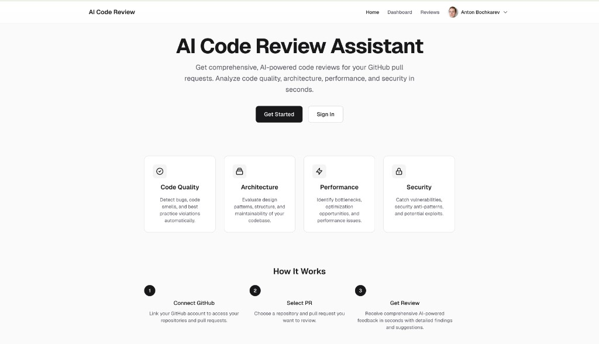
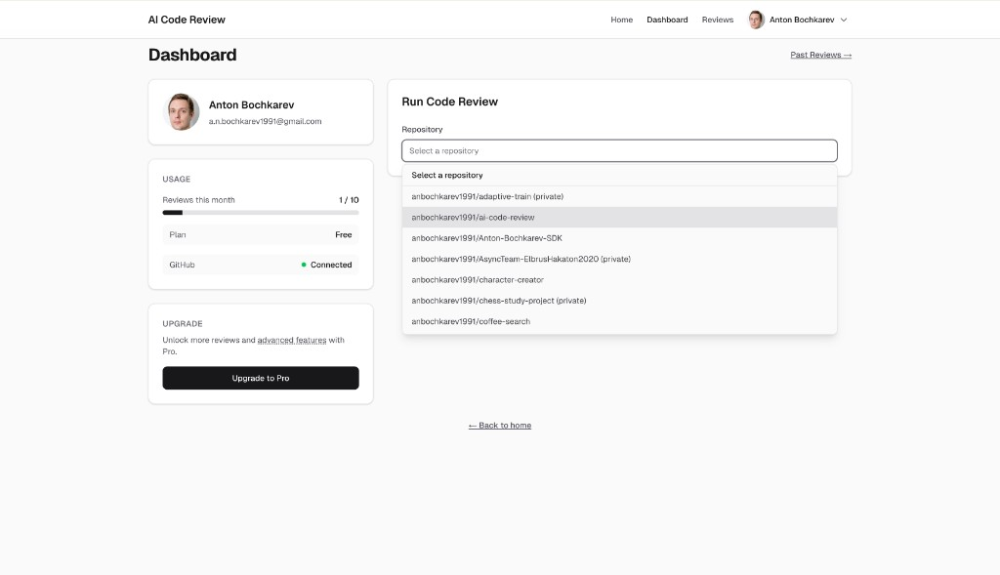
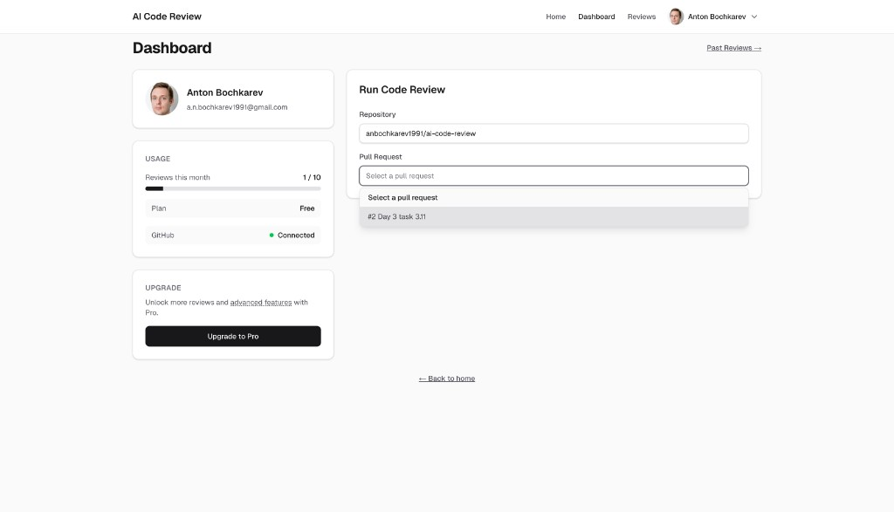
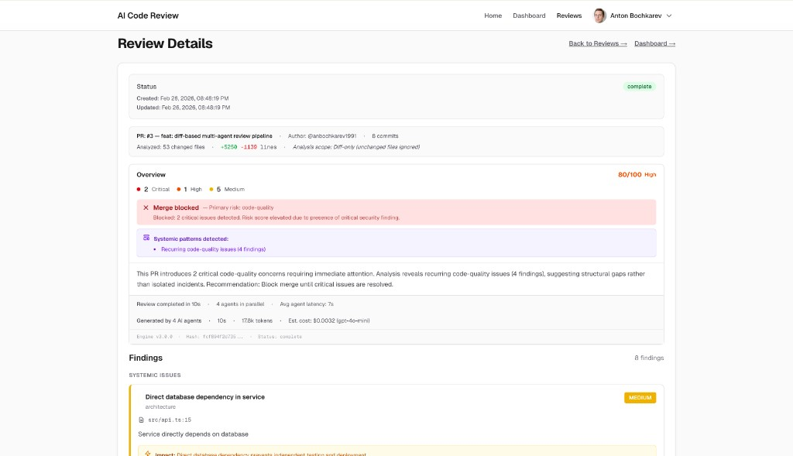
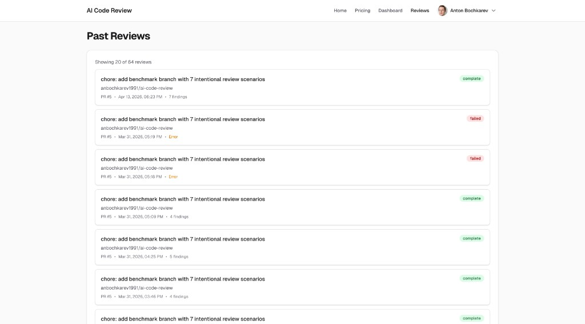
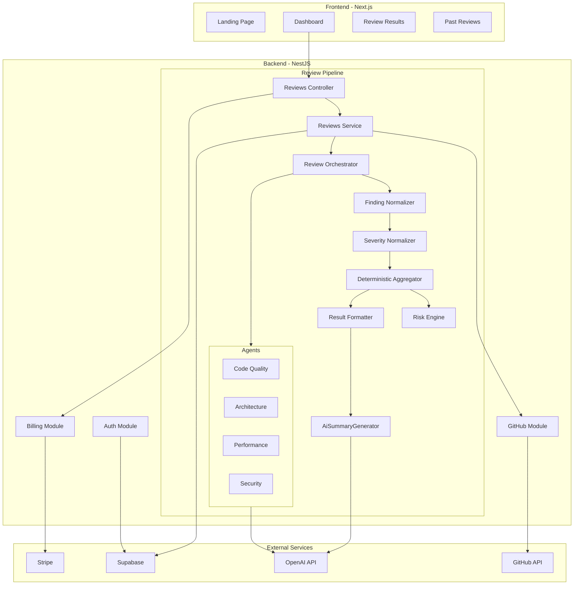

# AI Code Review Assistant

**Live demo:** [ai-code-review-gamma.vercel.app](https://ai-code-review-gamma.vercel.app/)

An AI-powered code review tool that analyzes GitHub pull requests across four domains — code quality, architecture, performance, and security — using parallel LLM agents, deterministic risk scoring, and structured merge recommendations.



---

## Overview

AI Code Review Assistant is a full-stack application that connects to your GitHub repositories, fetches pull request diffs, and runs them through a multi-agent analysis pipeline. Each agent specializes in a different review domain. Findings are normalized, deduplicated, scored for risk, and presented as a structured review with a clear merge recommendation.

The system is designed to work with **diffs only** — it analyzes changed code rather than entire files, keeping reviews focused and reducing noise.

---

## Why this project exists

Manual code reviews are time-consuming and inconsistent. Reviewers often focus on surface-level issues while missing architectural problems or security risks. When teams move fast, reviews get rushed or skipped.

This project provides a structured, repeatable review pipeline that:

- Runs in seconds, not hours — four agents analyze the PR diff in parallel.
- Covers domains that are easy to overlook under time pressure (performance anti-patterns, security issues, architectural drift).
- Produces a quantified risk score and a deterministic merge recommendation, giving teams a data-informed signal alongside human judgment.
- Tracks review cost and token usage transparently, so there are no surprises.

It is not a replacement for human review. It is a fast, systematic first pass that catches what humans tend to miss.

---

## Key capabilities

- **Diff-scoped analysis** — only changed code is analyzed; unchanged files are excluded.
- **Four specialized agents** — Code Quality, Architecture, Performance, and Security run in parallel with independent timeout and retry logic.
- **Deterministic risk scoring** — exponential risk model (0–100) based on severity-weighted findings.
- **Merge recommendation** — structured decision (Safe to merge / Merge with caution / Merge blocked) derived from risk score and critical findings.
- **Finding normalization** — confidence clamping, multi-agent consensus detection, false positive risk estimation, and severity coherence checks.
- **AI Review Summary** — concise executive overview of main risks, themes, and recommendation, generated from final findings.
- **Systemic issue detection** — recurring patterns across findings are surfaced separately from code-level issues.
- **Review telemetry** — per-agent latency, token counts, prompt sizes, and status tracked in every review.
- **Cost estimation** — USD cost computed from token usage and model rates.
- **Review integrity** — SHA-256 review hash and engine/agent version stamps for reproducibility.
- **Usage-based billing** — free tier (10 reviews/month) and Pro tier (200 reviews/month) via Stripe.
- **Review history** — all past reviews are persisted and browsable.

---

## Product walkthrough

### 1. Connect and select

After signing in (Google or Microsoft) and connecting your GitHub account, the dashboard lists your repositories. Select a repo and an open pull request.



*The dashboard shows your profile, usage quota, plan status, and GitHub connection. The repository dropdown lists all accessible repos, including private ones.*



*After selecting a repository, open pull requests are loaded and shown in a dropdown.*

### 2. Run the review

Click **Run Code Review**. The backend fetches the PR diff from GitHub, parses it, and dispatches it to four agents in parallel. A typical review completes in under 15 seconds.

### 3. Read the results

The review result includes:

- **AI Review Summary** — overall assessment, key concerns (2–4 bullets), and a practical recommendation.
- **PR metadata** — file count, additions/deletions, commit count, analysis scope.
- **Severity breakdown** — counts of critical, high, medium, and low findings.
- **Risk score** — 0 to 100, with a risk level label (Low / Moderate / High / Critical).
- **Merge recommendation** — actionable decision with explanation.
- **Systemic patterns** — recurring issues flagged separately.
- **Individual findings** — each with file, line, message, suggested fix, confidence, false positive risk, and diff context.
- **Execution telemetry** — agent count, duration, tokens, estimated cost, engine version, and review hash.



*A completed review showing risk score (80/100, High), merge blocked status, systemic pattern detection, and execution metadata. Below the summary, findings are listed with severity badges, file locations, and suggested fixes.*

### 4. Browse past reviews

All reviews are persisted and accessible from the **Past Reviews** page, showing repo, PR number, timestamp, finding count, and status.



*Review history with completion status and finding counts. Each entry links to the full review detail.*

---

## How it works

```
User selects repo + PR
        │
        ▼
Backend fetches PR diff via GitHub API
        │
        ▼
DiffParser filters and parses hunks
(ignores lock files, binaries, node_modules, etc.)
        │
        ▼
┌───────────────────────────────────────────┐
│     4 agents run in parallel              │
│  ┌──────────┐ ┌──────────┐ ┌──────────┐  │
│  │  Code    │ │  Archi-  │ │  Perfor- │  │
│  │  Quality │ │  tecture │ │  mance   │  │
│  └──────────┘ └──────────┘ └──────────┘  │
│  ┌──────────┐                             │
│  │ Security │  30s timeout / 1 retry each │
│  └──────────┘                             │
└───────────────────────────────────────────┘
        │
        ▼
FindingNormalizer
(confidence clamping, diff boundary enforcement,
 consolidation, consensus detection, false positive risk)
        │
        ▼
SeverityNormalizer
(severity adjustments, multi-agent boosts,
 cap enforcement, root-cause merging)
        │
        ▼
DeterministicAggregator
(risk score, risk level, merge decision,
 systemic patterns, review summary)
        │
        ▼
ResultFormatter
(execution metadata, cost estimate, telemetry)
        │
        ▼
AiSummaryGenerator
(LLM synthesizes findings into executive summary)
        │
        ▼
Persist to Supabase + return to frontend
```

Each agent receives the parsed diff formatted as markdown with per-file sections. Agent output is validated against a shared Zod schema with up to 2 retries on malformed JSON. The orchestrator uses `Promise.allSettled` so a single agent failure never blocks the pipeline — partial results are still returned and clearly labeled.

---

## Architecture



**Separation of concerns:**

- **Frontend** handles auth (Supabase SSR), navigation, and rendering. It has no business logic — it sends requests to the backend and displays results.
- **Backend** owns the entire review pipeline, billing, and GitHub integration. Each NestJS module (Auth, GitHub, Billing, Reviews) is self-contained.
- **Shared** package contains TypeScript types, Zod schemas, merge-decision logic, and model rate tables — used by both frontend and backend.
- **Agents** are isolated injectable services. Each receives parsed diff files and returns structured findings validated against a shared schema.
- **Aggregation** is deterministic — no randomness in scoring, merge decisions, or normalization. Same diff + same agent outputs = same result.

---

## Technical highlights

- **Diff-only scope.** The `DiffParser` filters out non-code files (lock files, binaries, generated assets) and formats only changed hunks for agent consumption. This reduces token usage and keeps findings relevant.

- **Resilient orchestration.** `Promise.allSettled` with per-agent timeouts (30s default) and single retry on transient errors. Non-retryable errors (401, 402, 429) fail fast. Partial results are surfaced rather than lost.

- **Multi-layer normalization.** Findings pass through confidence clamping (0.3–0.95), diff boundary enforcement (outside-diff findings penalized), cross-agent consolidation, severity coherence, and uncertainty phrase detection before scoring.

- **Deterministic merge logic.** The merge decision is a pure function of severity counts and risk score — no LLM involved. Any critical finding blocks merge; 3+ high findings or risk score >= 60 triggers caution.

- **AI Review Summary.** After findings are aggregated and normalized, a single LLM call synthesizes them into a concise executive summary (overall assessment, key concerns, recommendation). Generation is non-blocking — if it fails, the pipeline completes and the block is omitted.

- **Zod-validated agent output.** Agent responses are parsed against a strict Zod schema with up to 2 retries, preventing malformed data from propagating through the pipeline.

- **Cost transparency.** Token usage is tracked per agent and converted to USD estimates using per-model rate tables defined in the shared package.

- **Review integrity.** Each review is stamped with a SHA-256 hash of the diff + engine/agent versions, enabling reproducibility verification.

---

## Tech stack

| Layer | Technology |
|-------|-----------|
| Frontend | Next.js 16 (App Router), React 19, Tailwind CSS v4 |
| Backend | NestJS, Node.js 22 |
| Auth | Supabase Auth (Google, Microsoft OAuth), JWT |
| Database | Supabase (PostgreSQL) with Row Level Security |
| AI | OpenAI API (gpt-4o-mini default, configurable) |
| Billing | Stripe (subscriptions, webhooks, checkout) |
| Validation | Zod (shared schemas) |
| Deployment | Vercel (frontend), Railway / Koyeb / Docker (backend) |

---

## Running the project locally

### Prerequisites

- Node.js >= 22
- A [Supabase](https://supabase.com) project (see [docs/SUPABASE_SETUP.md](docs/SUPABASE_SETUP.md))
- A [GitHub OAuth App](https://github.com/settings/developers) (see [docs/GITHUB_SETUP.md](docs/GITHUB_SETUP.md))
- An [OpenAI API key](https://platform.openai.com/api-keys)
- Optionally, a [Stripe](https://stripe.com) account for billing (see [docs/STRIPE_SETUP.md](docs/STRIPE_SETUP.md))

### Environment variables

Create `.env` files from the examples:

```bash
# Root
cp .env.example .env

# Backend
cp backend/.env.example backend/.env

# Frontend
cp frontend/.env.example frontend/.env
```

**Backend** (`backend/.env`):

| Variable | Description |
|----------|-------------|
| `PORT` | Server port (default: 3001) |
| `SUPABASE_URL` | Your Supabase project URL |
| `SUPABASE_ANON_KEY` | Supabase anonymous key |
| `SUPABASE_SERVICE_ROLE_KEY` | Supabase service role key (server-side only) |
| `GITHUB_CLIENT_ID` | GitHub OAuth app client ID |
| `GITHUB_CLIENT_SECRET` | GitHub OAuth app client secret |
| `GITHUB_OAUTH_REDIRECT_URI` | OAuth callback URL |
| `FRONTEND_URL` | Frontend origin for CORS and redirects |
| `OPENAI_API_KEY` | OpenAI API key |
| `OPENAI_MODEL` | Model to use (default: `gpt-4o-mini`) |
| `USE_MOCK_OPENAI_RESPONSES` | Set to `true` to skip real API calls during development |
| `STRIPE_SECRET_KEY` | Stripe secret key |
| `STRIPE_PRO_PRICE_ID` | Stripe price ID for Pro plan |
| `STRIPE_WEBHOOK_SECRET` | Stripe webhook signing secret |

**Frontend** (`frontend/.env`):

| Variable | Description |
|----------|-------------|
| `NEXT_PUBLIC_SUPABASE_URL` | Supabase project URL |
| `NEXT_PUBLIC_SUPABASE_ANON_KEY` | Supabase anonymous key |
| `NEXT_PUBLIC_BACKEND_URL` | Backend URL (default: `http://localhost:3001`) |

### Install and run

```bash
# Install shared dependencies and build
cd shared && npm install && npm run build && cd ..

# Start the backend
cd backend && npm install && npm run start:dev

# In a separate terminal — start the frontend
cd frontend && npm install && npm run dev
```

The frontend runs on `http://localhost:3000`, the backend on `http://localhost:3001`.

### Database setup

Run the Supabase migrations in order. The migration files are in `supabase/migrations/` and create the following tables: `profiles`, `github_connections`, `subscriptions`, `review_runs`, `usage`.

### Notes

- Set `USE_MOCK_OPENAI_RESPONSES=true` in the backend `.env` to develop without burning API credits.
- The backend requires `rawBody: true` for Stripe webhook signature verification — this is already configured in `main.ts`.
- GitHub OAuth redirect URI must match exactly between your GitHub app settings and `GITHUB_OAUTH_REDIRECT_URI`.

---

## Deployment

### Frontend

Deployed to **Vercel**. Configuration is in `vercel.json`. Set the three `NEXT_PUBLIC_*` environment variables in the Vercel dashboard.

### Backend

Multiple deployment options are supported:

- **Railway** — configured via `railway.json` and `nixpacks.toml`. See [docs/RAILWAY_DEPLOYMENT.md](docs/RAILWAY_DEPLOYMENT.md).
- **Koyeb** — configured via `koyeb.toml` with health check on `/health`. See [docs/KOYEB_DEPLOYMENT.md](docs/KOYEB_DEPLOYMENT.md).
- **Docker** — multi-stage `Dockerfile` at the repo root. Builds `shared` then `backend`, exposes port 8000.
- **Any Nixpacks-compatible platform** — `nixpacks.toml` handles build and start commands.

All backend deployments require the full set of environment variables listed above. The `FRONTEND_URL` / `CORS_ORIGINS` variable must point to the deployed frontend URL.

---

## Limitations and current status

This is a working MVP. The core pipeline — diff parsing, multi-agent analysis, aggregation, scoring, and result rendering — is functional and deployed.

Current limitations:

- **No GitHub App integration.** The system uses OAuth personal access tokens, not a GitHub App installation. This means the user must manually trigger reviews from the dashboard rather than receiving them automatically on PR creation.
- **No webhook-triggered reviews.** Reviews are user-initiated only. There is no automatic review on push or PR open.
- **Finding actions are UI-only.** The "Mark as resolved", "Ignore", and "Create ticket" buttons on findings are present in the UI but do not persist state.
- **Single model.** The pipeline currently supports one OpenAI model per deployment. There is no per-agent model selection or model routing.
- **Token budget is fixed.** Each agent receives a 3,500-token budget for diff content. Very large PRs are truncated.
- **No inline PR comments.** Review results are shown in the app UI, not posted as GitHub PR comments.

---

## Future improvements

- GitHub App integration for automatic reviews on PR events.
- Post findings as inline comments on GitHub PRs.
- Per-agent model selection and configurable token budgets.
- Support for additional LLM providers (Anthropic, open-source models).
- Persistent finding state (resolved, ignored, ticket created).
- Team-level dashboards and aggregated review metrics.
- Configurable review policies (e.g., skip low-severity findings, focus on specific categories).
- CI/CD integration (GitHub Actions, GitLab CI).

---

## License

MIT — see [LICENSE](LICENSE).
